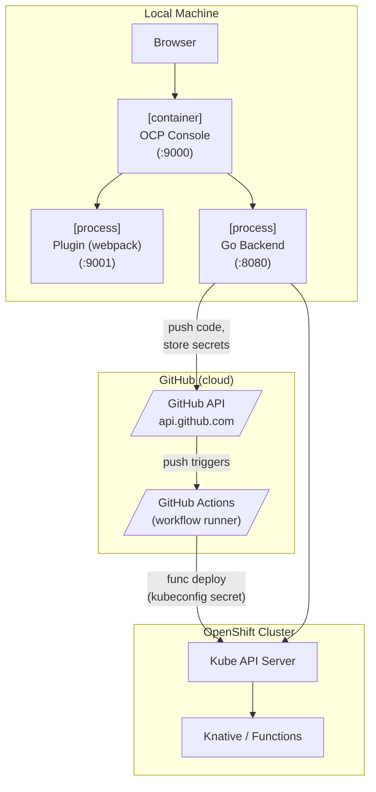
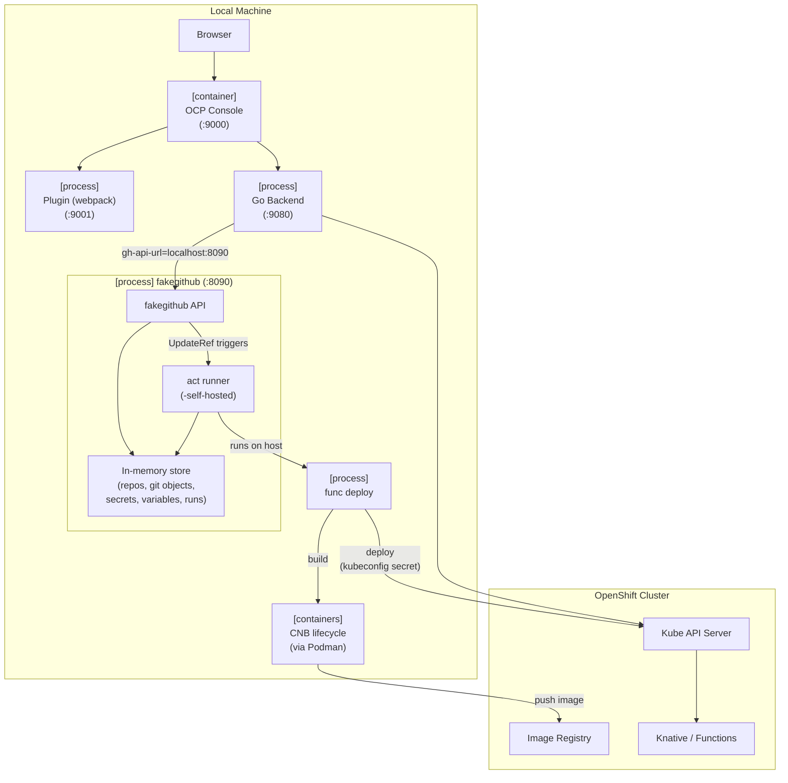
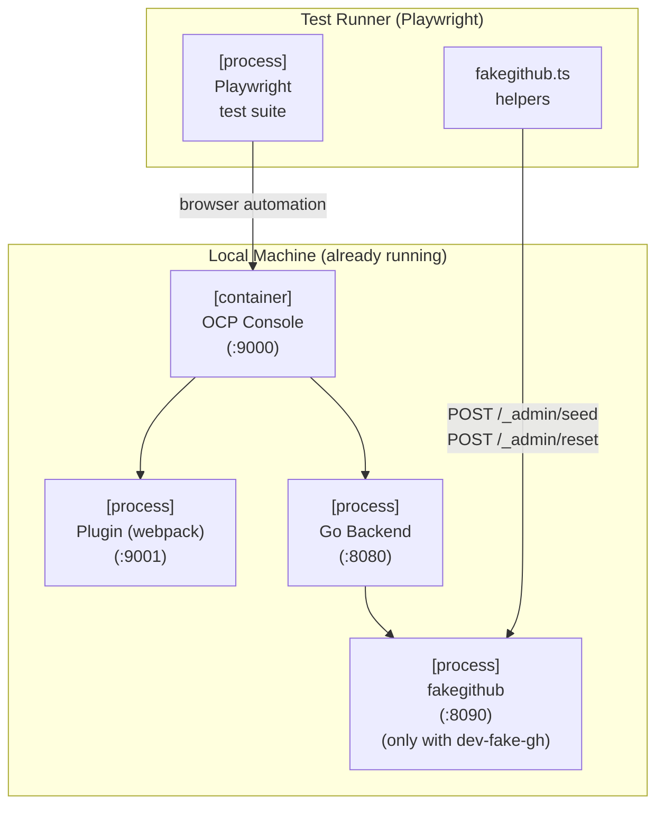
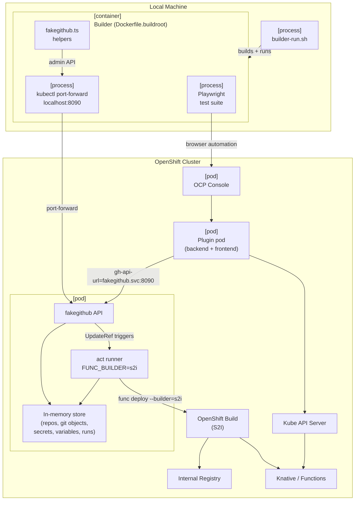
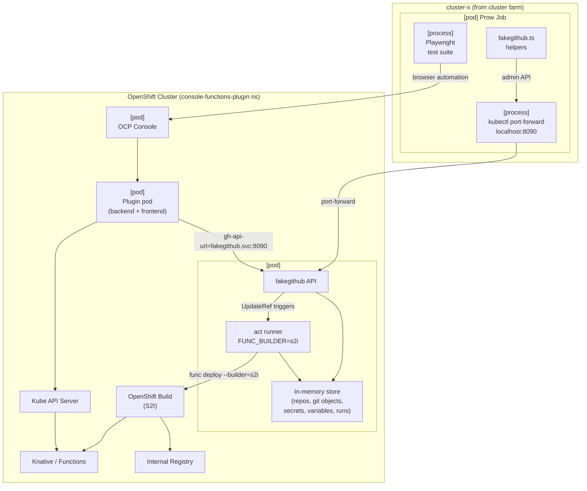
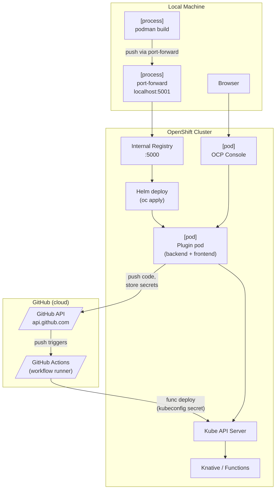

## Component Diagrams

These diagrams show which processes run where and how they communicate for each make target. 
Legend: 
- `[process]` = native OS process
- `[container]` = local Podman container
- `[pod]` = Kubernetes/OpenShift pod, parallelograms = external cloud services.

---

### make dev

---

### make dev-fake-gh

---

### make test-e2e

Runs Playwright tests against an already-running dev environment (either `make dev` or `make dev-fake-gh`). The environment determines whether a real or fake GitHub is used.

---

### hack/builder-run.sh make e2e

Local equivalent of the Prow CI flow. Builds and runs a builder container that executes `make e2e` with a real cluster kubeconfig.

---

### make e2e (Prow CI only)

Runs inside a Prow job pod in the cluster farm. Identical cluster-side topology to `builder-run.sh make e2e`.

---

### make deploy-dev

